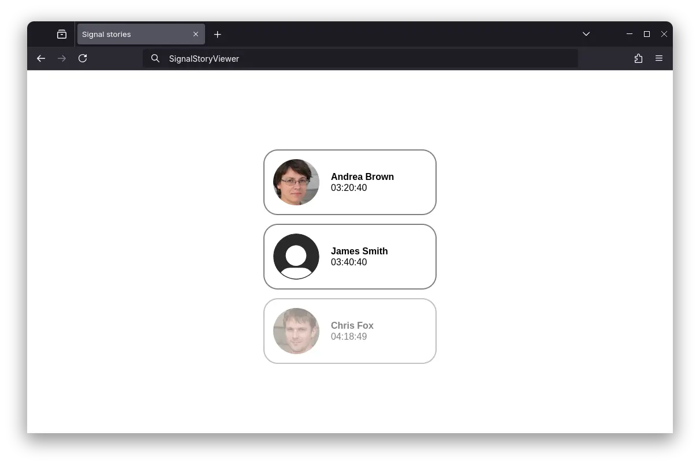
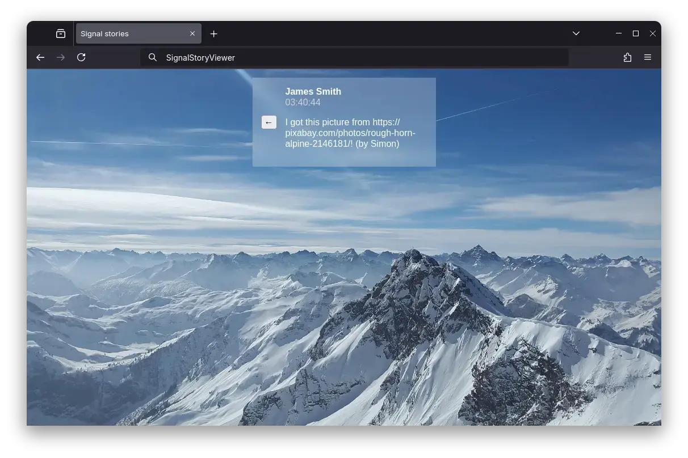

# Signal Story Viewer

A simple interface utilizing [signal-cli](https://github.com/AsamK/signal-cli) to view Signal stories from your contacts in a web browser.

    
    

---

Before running Signal Story Viewer, please make sure you've installed signal-cli through [Flatpak](https://flathub.org/apps/org.asamk.SignalCli) and set up an account correctly. Then clone this repository, install the required dependencies (you'll need Node and packages installed through npm or its equivalents, and Python with flask-svelte), fill in the config file (`app/config.py`) based on the provided example file, run, hope for the best, enjoy the app and have a nice rest of your day.

Based on the [flask-svelte](https://github.com/priyanshu-shubham/flask-svelte) template by Priyanshu Shubham  - thanks!